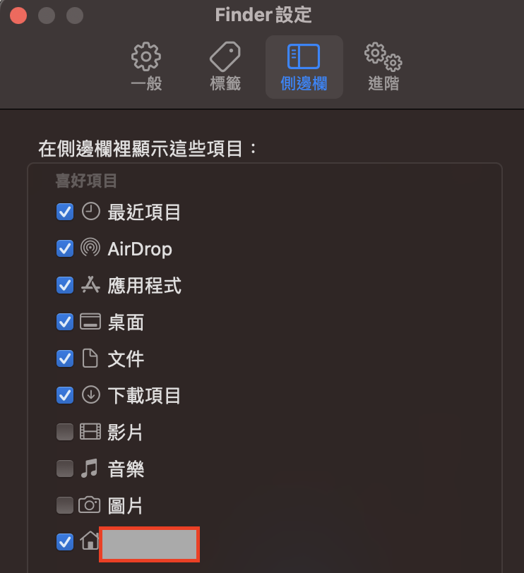

## [Oh My Zsh](https://ohmyz.sh/)

Oh My Zsh 是一個管理 zsh 的擴充套件，打開終端機，輸入以下指令安裝 Oh My Zsh：

```zsh
sh -c "$(curl -fsSL https://raw.githubusercontent.com/ohmyzsh/ohmyzsh/master/tools/install.sh)"
```

安裝完成後，可以透過 Oh My Zsh 設定檔，變更主題樣式：

```zsh
vim ~/.zshrc
```

找到 `ZSH_THEME="<theme>"`，將 `theme`替換成想要的[主題](https://github.com/ohmyzsh/ohmyzsh/wiki/Themes)

個人使用 [pure](https://github.com/sindresorhus/pure) 主題，依照官方文件安裝即可。

---

## [Homebrew](https://brew.sh/)

Homebrew 是一個 macOS 上的開源套件管理系統，方便開發者安裝、更新套件。

打開終端機，輸入以下指令安裝 Homebrew：

```sh
/bin/bash -c "$(curl -fsSL https://raw.githubusercontent.com/Homebrew/install/HEAD/install.sh)"
```

### 設定環境變數

執行 brew，可能會出現 brew command not found 的錯誤訊息。

需要輸入以下指令，將 homebrew 添加到系統的 PATH 環境變數中：

```sh
(echo; echo 'eval "$(/opt/homebrew/bin/brew shellenv)"') >> /Users/<換成自己使用者名稱>/.zprofile

eval "$(/opt/homebrew/bin/brew shellenv)"
```

可以通過 Finder 找到自己的使用者名稱，左上角 Finder > 設定 > 側邊欄，圖示為一個房子的，就是你的使用者名稱。



---

## NVM

nvm 是 node 版本管理器，在開發不同專案時，所使用的 node 版本可能不同，所以需要使用 nvm 管理不同的 node 版本。

打開終端機，輸入以下指令安裝 nvm：

```sh
curl -o- https://raw.githubusercontent.com/nvm-sh/nvm/v0.39.5/install.sh | bash
```

### Nvm 常用指令

```sh
nvm install <version> // 安裝指定版本的 node
nvm use <version> // 使用指定版本的 node
nvm list // 列出所有已安裝的 node 版本
nvm alias default <version> // 設定默認版本為指定版本
```

---

## Git

使用 homebrew 安裝 git：

```sh
brew install git
```

設定使用者名稱與電子郵件地址：

- `git config --global user.name "帳號名稱"`
- `git config --global user.email "帳號@email.com"`

---

## [VsCode](https://code.visualstudio.com/)

### 設定 code . 快捷鍵

打開 Vscode，按下 <kbd>Cmd</kbd> + <kbd>Shift</kbd> + <kbd>P</kbd>，選擇 「shell command，選擇 Install code」，之後就可以在終端機中直接用 `code .` 開啟 Vscode。

### 推薦的擴充套件

- [Winter is Coming theme](https://marketplace.visualstudio.com/items?itemName=johnpapa.winteriscoming)：Vscode 主題。
- [Material Icon Theme](https://marketplace.visualstudio.com/items?itemName=PKief.material-icon-theme)：Icon 主題。
- [Prettier](https://marketplace.visualstudio.com/items?itemName=esbenp.prettier-vscode)：排版工具
- [Code Spell Checker](https://marketplace.visualstudio.com/items?itemName=streetsidesoftware.code-spell-checker)：檢查英文拼字。
- [Auto Rename Tag](https://marketplace.visualstudio.com/items?itemName=formulahendry.auto-rename-tag)：自動重新命名 HTML 標籤。
- [GitLens](https://marketplace.visualstudio.com/items?itemName=eamodio.gitlens): 快速 Git blame 神器。
- [Git Graph](https://marketplace.cursorapi.com/items?itemName=mhutchie.git-graph): Git 線圖視覺化好幫手。
