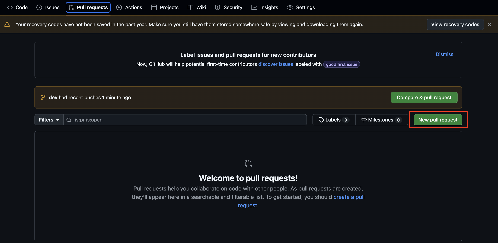
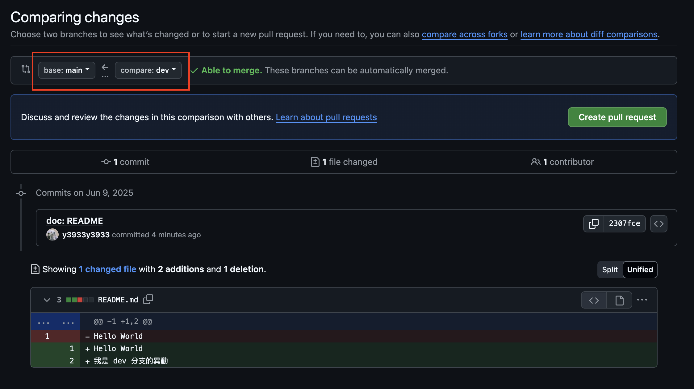
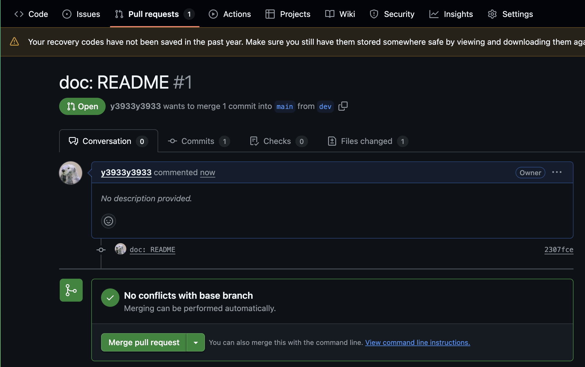

## toc

## 情境

小明是一個剛入職的前端工程師，過去都只有自己開發的經驗，到了新公司，團隊規模比較大，有不少同事會一起協作專案，小明感到很興奮！

上班一週後，小明被分派到一項小的 task，早上開完會後發生了以下對話:

主管：「小明，這項 task 你等等從 prod 開個 branch，做完之後發個 PR 給我，我幫你 Code Review。」

小明：（等等，開個 branch 我大概知道是什麼意思，**但 PR 是什麼？**）

## 什麼是 PR (Pull Request) ?

過去如果單打獨鬥，通常都是一個分支持續在上面做事情，但如果今天遇到團體協作，通常大家會各自開分支做事情，當我們完成某些工項，要將更改的程式碼 merge 到主要分支上，就會發起一個 PR。

## 實戰演練

可以使用 Github 來實際看 PR 是如何運作。

1. 新增一個 repository (或是使用現有的)，這裡我們先命名為 `pr-practice`
2. `git clone` 專案到本地
3. 新增一個 `README.md` 內容填上 Hello World
4. commit 完後 `git push` 到遠端，此時會發現遠端儲存庫有 `main` 分支
5. 本地用 `git checkout -b dev` ，新開一個名叫 `dev` 的分支
6. 修改 README file，底下新增一行 「我是 dev 分支的異動」
7. `git push -u origin dev` 將新增的 commit 推到遠端

此時會發現遠端儲存庫有兩個分支存在： `main` & `dev`

8. 在 Github 上點選 `Pull Request` Tab 後，按下 `New Pull Request` 按鈕
   

9. 上方會出現 `base` 和 `compare` 兩種分支，記得 base 選 `main`，compare 選 `dev`

<!--  -->

10. 選完後下方會出現異動的檔案及行數，確認無誤就可以按下「Create Pull Request」按鈕，就可以看到成功發起的 PR

## 結語

以上就是 PR 概念與基本流程，實務上發起 PR 後，有時候還會經過一些自動化流程，如：lint, build, test。

發起 PR 時也要注意填寫好你的異動的簡短標題與詳細內容，方便同事或主管 Code Review 時能快速了解你做了什麼事。
